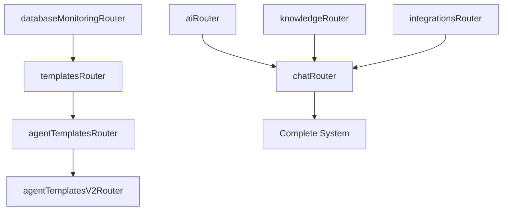

# Implementation Notes

> **Technical Implementation Details for tRPC Router Restoration**  
> **Created**: 2025-08-22  
> **Updated**: 2025-08-22  

## Current System Analysis

### Working Router Structure Pattern
Based on analysis of functional routers, the correct pattern is:

```typescript
// ✅ WORKING PATTERN - from agents/index.ts, auth/index.ts
import { createTRPCRouter, publicProcedure, protectedProcedure } from '@backend/trpc/create-context';

export const routerName = createTRPCRouter({
  procedureName: protectedProcedure
    .input(/* schema */)
    .query(async ({ input, ctx }) => {
      // implementation
    }),
  
  anotherProcedure: publicProcedure
    .mutation(async ({ input }) => {
      // implementation  
    })
});
```

### Problematic Router Structure Pattern  
The failing pattern found in MCP, voice, and example routes:

```typescript
// ❌ PROBLEMATIC PATTERN - causes "_def" error
import { publicProcedure } from '@backend/trpc/create-context';

export default publicProcedure
  .input(/* schema */)
  .query(async ({ input }) => {
    // implementation
  });
```

### Error Analysis
The error `TypeError: Cannot read properties of undefined (reading '_def')` occurs because:

1. **tRPC Router Merger** expects router objects with `_def` property
2. **Individual Procedures** don't have the router `_def` structure
3. **App Router Builder** tries to merge procedure exports as if they were routers
4. **Runtime Failure** happens during router initialization

## MCP Router Refactoring Strategy

### Current MCP File Structure
```
/trpc/routes/mcp/
├── servers/
│   ├── list.ts          → exports publicProcedure.query
│   ├── connect.ts       → exports publicProcedure.mutation  
│   ├── disconnect.ts    → exports publicProcedure.mutation
│   ├── remove.ts        → exports publicProcedure.mutation
│   └── status.ts        → exports publicProcedure.query
└── tools/
    ├── list.ts          → exports publicProcedure.query
    └── execute.ts       → exports publicProcedure.mutation
```

### Target MCP Router Structure
```typescript
// /trpc/routes/mcp/index.ts
export const mcpRouter = createTRPCRouter({
  servers: createTRPCRouter({
    list: /* extracted from servers/list.ts */,
    connect: /* extracted from servers/connect.ts */,
    disconnect: /* extracted from servers/disconnect.ts */,
    remove: /* extracted from servers/remove.ts */,
    status: /* extracted from servers/status.ts */
  }),
  tools: createTRPCRouter({
    list: /* extracted from tools/list.ts */,
    execute: /* extracted from tools/execute.ts */
  })
});
```

### MCP Router API Compatibility
Endpoint URLs will change from:
```
❌ OLD: /api/trpc/mcpServersList
❌ OLD: /api/trpc/mcpServersConnect
```

To:
```  
✅ NEW: /api/trpc/mcp.servers.list
✅ NEW: /api/trpc/mcp.servers.connect
```

**⚠️ Breaking Change Alert**: Frontend will need updates to match new URL structure.

## Voice Router Refactoring Strategy

### Current Voice File Structure
```
/trpc/routes/voice/
├── transcribe.ts        → exports publicProcedure.mutation
└── synthesize.ts        → exports publicProcedure.mutation
```

### Target Voice Router Structure
```typescript
// /trpc/routes/voice/index.ts
export const voiceRouter = createTRPCRouter({
  transcribe: /* extracted from transcribe.ts */,
  synthesize: /* extracted from synthesize.ts */
});
```

### Voice Router API Compatibility
Endpoint URLs will change from:
```
❌ OLD: /api/trpc/voiceTranscribe
❌ OLD: /api/trpc/voiceSynthesize  
```

To:
```
✅ NEW: /api/trpc/voice.transcribe
✅ NEW: /api/trpc/voice.synthesize
```

## Example Router Refactoring Strategy

### Current Example Structure
```
/trpc/routes/example/
└── hi/
    └── route.ts         → exports publicProcedure.query
```

### Target Example Router Structure  
```typescript
// /trpc/routes/example/index.ts
export const exampleRouter = createTRPCRouter({
  hi: /* extracted from hi/route.ts */
});
```

## Procedure Extraction Process

### Step-by-Step Extraction Method

1. **Open source file** (e.g., `mcp/servers/list.ts`)
2. **Identify the default export** (the procedure)
3. **Copy procedure definition** (from `publicProcedure` to final closing)
4. **Preserve imports** needed by the procedure
5. **Integrate into router object** with appropriate key name

### Example Extraction

**Source** (`mcp/servers/list.ts`):
```typescript
import { publicProcedure } from "@backend/trpc/create-context";
import { mcpManager } from "@backend/services/mcp-manager";

export default publicProcedure
  .query(async ({ ctx }) => {
    try {
      const servers = await mcpManager.listServers();
      // ... rest of implementation
    } catch (error) {
      // ... error handling
    }
  });
```

**Target Integration** (`mcp/index.ts`):
```typescript
import { createTRPCRouter, publicProcedure } from "@backend/trpc/create-context";
import { mcpManager } from "@backend/services/mcp-manager";

export const mcpRouter = createTRPCRouter({
  servers: createTRPCRouter({
    list: publicProcedure
      .query(async ({ ctx }) => {
        try {
          const servers = await mcpManager.listServers();
          // ... rest of implementation (copied exactly)
        } catch (error) {
          // ... error handling (copied exactly)
        }
      })
  })
});
```

## App Router Integration Updates

### Current App Router (Problematic)
```typescript
// MCP Router Imports - These cause the _def error
import mcpServersListRoute from "./routes/mcp/servers/list";
import mcpServersConnectRoute from "./routes/mcp/servers/connect";
// ... more individual imports

export const appRouter = createTRPCRouter({
  // These lines are commented out due to errors
  // mcpServersList: mcpServersListRoute,
  // mcpServersConnect: mcpServersConnectRoute,
});
```

### Target App Router (Fixed)  
```typescript
// Consolidated Router Imports
import { mcpRouter } from "./routes/mcp";
import { voiceRouter } from "./routes/voice";
import { exampleRouter } from "./routes/example";

export const appRouter = createTRPCRouter({
  // Core routers (already working)
  health: healthRouter,
  auth: authRouter,
  metrics: metricsRouter,
  agents: agentsRouter, 
  workflows: workflowsRouter,
  
  // Newly consolidated routers
  mcp: mcpRouter,
  voice: voiceRouter,
  example: exampleRouter,
  
  // Feature routers (to be re-enabled)
  ai: aiRouter,
  chat: chatRouter,
  integrations: integrationsRouter,
  knowledge: knowledgeRouter,
  templates: templatesRouter,
  agentTemplates: agentTemplatesRouter,
  agentTemplatesV2: agentTemplatesV2Router,
  database: databaseMonitoringRouter,
});
```

## Feature Router Re-enablement Order

### Dependency Analysis
Based on service dependencies and complexity:



### Re-enablement Strategy
1. **Start with isolated routers** (database, templates)
2. **Enable AI foundation** before chat system
3. **Enable integrations** before full chat functionality
4. **Chat router last** as it depends on most other systems

## Testing and Validation Approach

### Manual Testing Commands

**MCP Router Testing**:
```bash
# Test MCP servers
curl -X POST http://localhost:3001/api/trpc/mcp.servers.list \
  -H "Content-Type: application/json" \
  -d '{"json":{}}'

# Test MCP tools  
curl -X POST http://localhost:3001/api/trpc/mcp.tools.list \
  -H "Content-Type: application/json" \
  -d '{"json":{}}'
```

**Voice Router Testing**:
```bash  
# Test voice transcription
curl -X POST http://localhost:3001/api/trpc/voice.transcribe \
  -H "Content-Type: application/json" \
  -d '{"json":{"audioData":"base64data","conversationId":"test"}}'
```

**Example Router Testing**:
```bash
# Test example greeting
curl -X POST http://localhost:3001/api/trpc/example.hi \
  -H "Content-Type: application/json" \
  -d '{"json":{"name":"World"}}'
```

### Automated Testing Approach
```typescript
// Test router structure integrity
describe('tRPC Router Structure', () => {
  test('all routers have _def property', () => {
    expect(appRouter._def).toBeDefined();
    expect(appRouter._def.procedures.mcp).toBeDefined();
    expect(appRouter._def.procedures.voice).toBeDefined();
  });
  
  test('nested routers accessible', () => {
    expect(appRouter.mcp.servers.list).toBeDefined();
    expect(appRouter.mcp.tools.execute).toBeDefined();
    expect(appRouter.voice.transcribe).toBeDefined();
  });
});
```

## Performance Considerations

### Router Initialization Overhead
- **Consolidated routers** may have slightly higher initialization cost
- **Nested structure** adds minimal runtime overhead
- **Procedure count** remains the same, just organized differently

### Memory Usage
- **Import optimization**: Remove unused individual route files
- **Procedure sharing**: Reused imports across procedures
- **Bundle size**: Slight reduction due to less file overhead

## Security Considerations

### Authentication Patterns
Maintain existing patterns:
```typescript
// Protected procedures
protectedProcedure.use(rateLimitMiddleware).query(...)

// Public procedures with rate limiting
publicProcedure.use(generalApiRateLimit).mutation(...)
```

### Input Validation
Preserve all existing Zod schemas:
```typescript
.input(z.object({
  // Existing validation rules
}))
```

### Error Handling
Maintain consistent error response format:
```typescript  
catch (error) {
  logger.error('Operation failed', { error, userId: ctx.user?.id });
  throw new TRPCError({
    code: 'INTERNAL_SERVER_ERROR',
    message: 'Operation failed'
  });
}
```

## Rollback Strategy Details

### Git Strategy
```bash
# Create feature branch for work
git checkout -b fix/trpc-router-restoration

# Commit each major change separately
git add .
git commit -m "feat: consolidate MCP router structure"

# Rollback individual commits if needed
git revert HEAD~1  # Revert last commit
```

### Incremental Rollback
```typescript
// If MCP router fails, quickly disable it
export const appRouter = createTRPCRouter({
  // mcp: mcpRouter,  // <-- Comment out problematic router
  
  // Keep working routers enabled
  health: healthRouter,
  auth: authRouter,
  // ... others
});
```

### Service Availability During Rollback
- **Core services** (auth, health, agents) remain available
- **Non-critical services** (MCP, voice) can be disabled temporarily
- **Frontend graceful degradation** should handle missing routes

## Common Issues and Solutions

### Import Path Issues
```typescript
// ❌ Wrong relative path
import { mcpManager } from "../../../services/mcp-manager";

// ✅ Use alias path
import { mcpManager } from "@backend/services/mcp-manager";
```

### TypeScript Type Issues
```typescript
// ❌ Procedure type not inferred correctly
const procedure = publicProcedure.query(...);

// ✅ Explicit procedure in router context
createTRPCRouter({
  procedureName: publicProcedure.query(...)
})
```

### Middleware Context Issues
```typescript
// ❌ Middleware context lost during extraction
.use(middleware)

// ✅ Preserve all middleware in exact order
.use(rateLimitMiddleware)
.use(authMiddleware)
```

## Success Validation Checklist

### Technical Validation
- [ ] Server starts without errors
- [ ] All router endpoints respond to requests
- [ ] Error responses maintain consistent format
- [ ] TypeScript compilation succeeds
- [ ] No runtime warnings or deprecation notices

### Functional Validation  
- [ ] MCP server management works
- [ ] MCP tool execution works
- [ ] Voice transcription processes audio
- [ ] Voice synthesis generates audio
- [ ] Example endpoint returns greeting
- [ ] All re-enabled feature routers functional

### Performance Validation
- [ ] Response times within acceptable ranges (<200ms simple, <2s complex)
- [ ] No memory leaks during extended operation
- [ ] Concurrent request handling works correctly
- [ ] Database connection pooling functions properly

This implementation approach ensures systematic restoration of all tRPC router functionality while maintaining system stability and enabling easy rollback if issues arise.