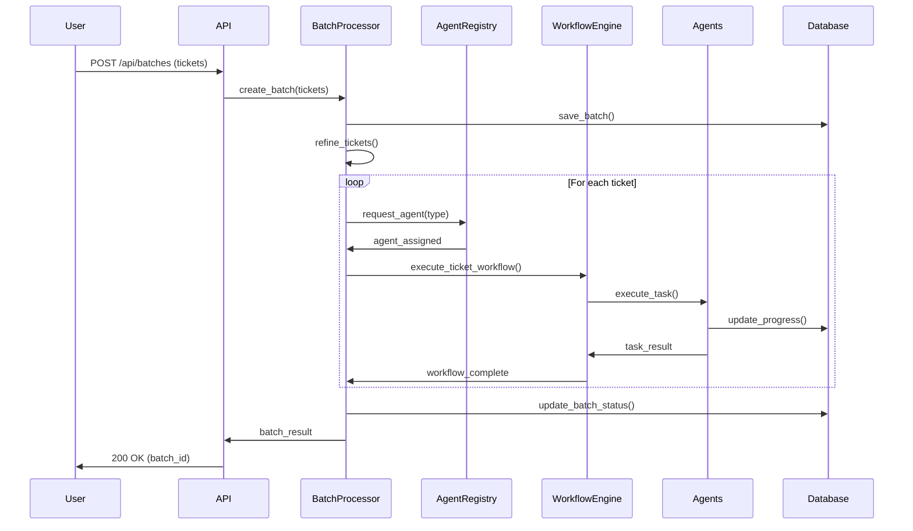
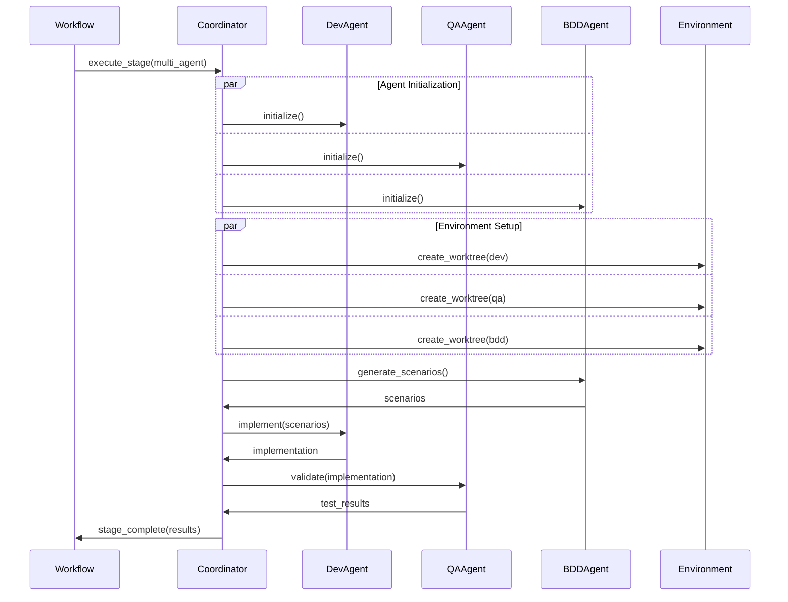
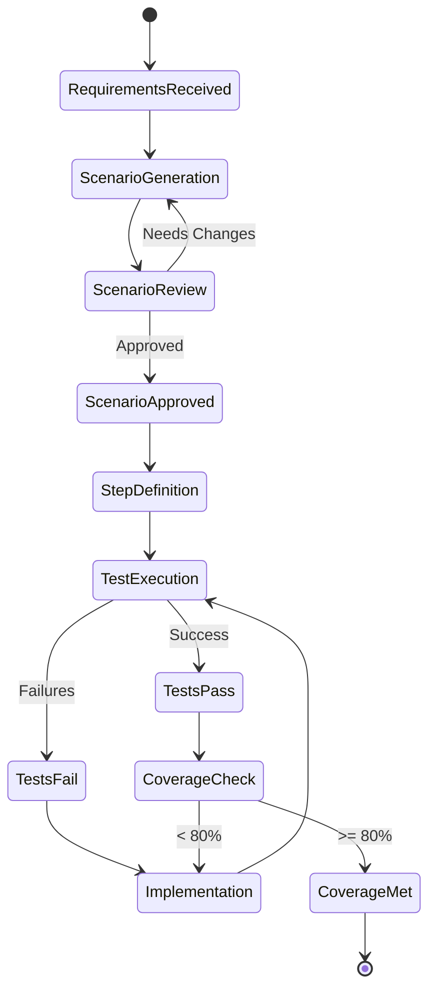

# Vibe Kanban Enhancement - Technical Architecture

**Version:** 1.0.0  
**Date:** 2025-01-24  
**Status:** Final  

## System Architecture Overview

```
┌────────────────────────────────────────────────────────────────────────┐
│                          External Interfaces                           │
├────────────────────────────────────────────────────────────────────────┤
│  Claude Code CLI │ MCP Clients │ Web Browser │ API Clients │ GitHub   │
└────────────────┬────────┬──────────┬──────────┬────────────┬──────────┘
                 │        │          │          │            │
┌────────────────▼────────▼──────────▼──────────▼────────────▼──────────┐
│                         API Gateway Layer                              │
├─────────────────────────────────────────────────────────────────────────┤
│  • REST API (Axum)                                                     │
│  • MCP Server (Enhanced)                                               │
│  • WebSocket/SSE Endpoints                                             │
│  • Authentication & Authorization                                      │
└─────────────────────────────┬───────────────────────────────────────────┘
                             │
┌─────────────────────────────▼───────────────────────────────────────────┐
│                      Orchestration & Coordination Layer                 │
├─────────────────────────────────────────────────────────────────────────┤
│  ┌─────────────────┐  ┌──────────────────┐  ┌────────────────────┐    │
│  │ Workflow Engine │  │ Agent Coordinator │  │ Batch Processor    │    │
│  └─────────────────┘  └──────────────────┘  └────────────────────┘    │
│  ┌─────────────────┐  ┌──────────────────┐  ┌────────────────────┐    │
│  │ BDD Framework   │  │ Design System     │  │ Resource Manager   │    │
│  └─────────────────┘  └──────────────────┘  └────────────────────┘    │
└─────────────────────────────┬───────────────────────────────────────────┘
                             │
┌─────────────────────────────▼───────────────────────────────────────────┐
│                          Agent Execution Layer                          │
├─────────────────────────────────────────────────────────────────────────┤
│  ┌────────┐ ┌────────┐ ┌────────┐ ┌────────┐ ┌────────┐ ┌────────┐   │
│  │  Dev   │ │   QA   │ │  Doc   │ │ Design │ │  BDD   │ │ Review │   │
│  │ Agent  │ │ Agent  │ │ Agent  │ │ Agent  │ │ Agent  │ │ Agent  │   │
│  └────────┘ └────────┘ └────────┘ └────────┘ └────────┘ └────────┘   │
│                                                                         │
│  Agent Registry │ Agent Loader │ Agent Validator │ Agent Monitor       │
└─────────────────────────────┬───────────────────────────────────────────┘
                             │
┌─────────────────────────────▼───────────────────────────────────────────┐
│                      Environment Isolation Layer                        │
├─────────────────────────────────────────────────────────────────────────┤
│  ┌─────────────────┐  ┌──────────────────┐  ┌────────────────────┐    │
│  │ Worktree Manager│  │ Test DB Provider │  │ Mock Service Mgr   │    │
│  └─────────────────┘  └──────────────────┘  └────────────────────┘    │
│  ┌─────────────────┐  ┌──────────────────┐  ┌────────────────────┐    │
│  │ Resource Limiter│  │ Network Isolator │  │ Cleanup Scheduler  │    │
│  └─────────────────┘  └──────────────────┘  └────────────────────┘    │
└─────────────────────────────┬───────────────────────────────────────────┘
                             │
┌─────────────────────────────▼───────────────────────────────────────────┐
│                          Data Persistence Layer                         │
├─────────────────────────────────────────────────────────────────────────┤
│  ┌─────────────────┐  ┌──────────────────┐  ┌────────────────────┐    │
│  │   SQLite/PG     │  │  Git Repository  │  │   File System      │    │
│  └─────────────────┘  └──────────────────┘  └────────────────────┘    │
└─────────────────────────────────────────────────────────────────────────┘
```

## Component Details

### 1. API Gateway Layer

#### 1.1 REST API (Axum)
```rust
// New route structure
pub fn configure_routes(app: Router) -> Router {
    app
        // Existing routes
        .nest("/api/projects", project_routes())
        .nest("/api/tasks", task_routes())
        
        // New batch processing routes
        .nest("/api/batches", batch_routes())
        
        // New agent management routes
        .nest("/api/agents", agent_routes())
        
        // New workflow routes
        .nest("/api/workflows", workflow_routes())
        
        // New BDD routes
        .nest("/api/bdd", bdd_routes())
        
        // New design routes
        .nest("/api/design", design_routes())
}
```

#### 1.2 Enhanced MCP Server
```rust
pub struct EnhancedMcpServer {
    // Existing
    base_server: McpServer,
    
    // New additions
    batch_tools: BatchProcessingTools,
    agent_tools: AgentCoordinationTools,
    bdd_tools: BddTools,
    design_tools: DesignTools,
}
```

### 2. Orchestration Layer

#### 2.1 Workflow Engine Architecture
```rust
pub struct WorkflowEngine {
    config_store: Arc<WorkflowConfigStore>,
    stage_executor: Arc<StageExecutor>,
    dependency_resolver: DependencyResolver,
    parallel_executor: ParallelExecutor,
    failure_handler: FailureHandler,
    event_bus: Arc<EventBus>,
}

impl WorkflowEngine {
    pub async fn execute_workflow(
        &self,
        workflow_id: Uuid,
        context: WorkflowContext,
    ) -> Result<WorkflowResult> {
        // 1. Load workflow configuration
        let config = self.config_store.get(workflow_id).await?;
        
        // 2. Resolve stage dependencies
        let execution_plan = self.dependency_resolver
            .create_execution_plan(&config)?;
        
        // 3. Execute stages according to plan
        for stage_group in execution_plan.stage_groups {
            if stage_group.parallel {
                self.parallel_executor
                    .execute_stages(&stage_group.stages, &context)
                    .await?;
            } else {
                for stage in stage_group.stages {
                    self.stage_executor
                        .execute_stage(&stage, &context)
                        .await?;
                }
            }
        }
        
        Ok(WorkflowResult::completed())
    }
}
```

#### 2.2 Agent Coordinator
```rust
pub struct AgentCoordinator {
    registry: Arc<AgentRegistry>,
    session_manager: SessionManager,
    communication_bus: Arc<CommunicationBus>,
    context_store: Arc<ContextStore>,
}

impl AgentCoordinator {
    pub async fn coordinate_multi_agent_task(
        &self,
        task: MultiAgentTask,
    ) -> Result<TaskResult> {
        // 1. Assign agents to subtasks
        let assignments = self.assign_agents(&task).await?;
        
        // 2. Create isolated environments
        let environments = self.create_environments(&assignments).await?;
        
        // 3. Initialize agent sessions
        let sessions = self.initialize_sessions(&assignments, &environments).await?;
        
        // 4. Execute with coordination
        let results = self.execute_coordinated(&sessions, &task).await?;
        
        // 5. Aggregate results
        self.aggregate_results(results).await
    }
}
```

### 3. Agent Execution Layer

#### 3.1 Agent Type Hierarchy
```rust
// Base trait for all agents
pub trait Agent: Send + Sync {
    fn agent_type(&self) -> AgentType;
    fn capabilities(&self) -> Vec<Capability>;
    
    async fn execute(
        &self,
        task: &Task,
        context: &ExecutionContext,
    ) -> Result<TaskResult>;
    
    async fn validate_environment(
        &self,
        env: &Environment,
    ) -> Result<()>;
}

// Specialized agent implementations
pub struct DevelopmentAgent {
    base_executor: Box<dyn CodingAgent>,
    code_analyzer: CodeAnalyzer,
    test_runner: TestRunner,
}

pub struct QualityAssuranceAgent {
    base_executor: Box<dyn CodingAgent>,
    test_generator: TestGenerator,
    coverage_analyzer: CoverageAnalyzer,
    performance_tester: PerformanceTester,
}

pub struct BddAgent {
    scenario_generator: ScenarioGenerator,
    step_implementer: StepImplementer,
    gherkin_parser: GherkinParser,
}

pub struct DesignAgent {
    prompt_processor: PromptProcessor,
    artifact_generator: ArtifactGenerator,
    constraint_validator: ConstraintValidator,
}
```

### 4. Data Flow Diagrams

#### 4.1 Batch Processing Flow


#### 4.2 Multi-Agent Coordination Flow


#### 4.3 BDD-Driven Development Flow


### 5. Database Schema

```sql
-- Core batch processing tables
CREATE TABLE ticket_batches (
    id TEXT PRIMARY KEY,
    project_id TEXT NOT NULL,
    status TEXT NOT NULL,
    strategy TEXT NOT NULL,
    parallel_limit INTEGER,
    created_at DATETIME,
    completed_at DATETIME,
    FOREIGN KEY (project_id) REFERENCES projects(id)
);

CREATE TABLE batch_tickets (
    id TEXT PRIMARY KEY,
    batch_id TEXT NOT NULL,
    raw_description TEXT NOT NULL,
    priority TEXT,
    complexity_level TEXT,
    dependencies TEXT, -- JSON
    refined_task_id TEXT,
    status TEXT NOT NULL,
    FOREIGN KEY (batch_id) REFERENCES ticket_batches(id),
    FOREIGN KEY (refined_task_id) REFERENCES tasks(id)
);

-- Agent configuration tables
CREATE TABLE agent_configs (
    id TEXT PRIMARY KEY,
    name TEXT NOT NULL,
    agent_type TEXT NOT NULL,
    base_executor TEXT NOT NULL,
    specialized_instructions TEXT,
    max_parallel_tasks INTEGER,
    tools_enabled TEXT, -- JSON
    environment_requirements TEXT, -- JSON
    created_at DATETIME,
    updated_at DATETIME
);

CREATE TABLE agent_sessions (
    id TEXT PRIMARY KEY,
    agent_id TEXT NOT NULL,
    task_id TEXT NOT NULL,
    worktree_path TEXT,
    status TEXT NOT NULL,
    started_at DATETIME,
    completed_at DATETIME,
    FOREIGN KEY (agent_id) REFERENCES agent_configs(id),
    FOREIGN KEY (task_id) REFERENCES tasks(id)
);

-- Workflow configuration tables
CREATE TABLE workflow_configs (
    id TEXT PRIMARY KEY,
    project_id TEXT NOT NULL,
    name TEXT NOT NULL,
    stages TEXT NOT NULL, -- JSON
    parallel_execution BOOLEAN,
    failure_strategy TEXT,
    created_at DATETIME,
    FOREIGN KEY (project_id) REFERENCES projects(id)
);

CREATE TABLE workflow_executions (
    id TEXT PRIMARY KEY,
    workflow_config_id TEXT NOT NULL,
    batch_id TEXT,
    status TEXT NOT NULL,
    current_stage TEXT,
    context TEXT, -- JSON
    started_at DATETIME,
    completed_at DATETIME,
    FOREIGN KEY (workflow_config_id) REFERENCES workflow_configs(id),
    FOREIGN KEY (batch_id) REFERENCES ticket_batches(id)
);

-- BDD tables
CREATE TABLE bdd_features (
    id TEXT PRIMARY KEY,
    project_id TEXT NOT NULL,
    feature_name TEXT NOT NULL,
    description TEXT,
    scenarios TEXT NOT NULL, -- JSON
    tags TEXT, -- JSON
    created_at DATETIME,
    last_run DATETIME,
    last_run_status TEXT,
    FOREIGN KEY (project_id) REFERENCES projects(id)
);

CREATE TABLE bdd_test_runs (
    id TEXT PRIMARY KEY,
    feature_id TEXT NOT NULL,
    task_attempt_id TEXT,
    scenario_results TEXT NOT NULL, -- JSON
    coverage_report TEXT, -- JSON
    execution_time_ms INTEGER,
    agent_id TEXT,
    created_at DATETIME,
    FOREIGN KEY (feature_id) REFERENCES bdd_features(id),
    FOREIGN KEY (task_attempt_id) REFERENCES task_attempts(id)
);

-- Design system tables
CREATE TABLE design_prompts (
    id TEXT PRIMARY KEY,
    project_id TEXT NOT NULL,
    prompt_type TEXT NOT NULL,
    title TEXT NOT NULL,
    context TEXT NOT NULL, -- JSON
    constraints TEXT, -- JSON
    output_format TEXT NOT NULL,
    created_at DATETIME,
    FOREIGN KEY (project_id) REFERENCES projects(id)
);

CREATE TABLE design_artifacts (
    id TEXT PRIMARY KEY,
    prompt_id TEXT NOT NULL,
    artifact_type TEXT NOT NULL,
    content TEXT NOT NULL,
    iteration INTEGER DEFAULT 1,
    approved BOOLEAN DEFAULT FALSE,
    agent_id TEXT,
    created_at DATETIME,
    FOREIGN KEY (prompt_id) REFERENCES design_prompts(id)
);

-- Indexes for performance
CREATE INDEX idx_batch_tickets_batch_id ON batch_tickets(batch_id);
CREATE INDEX idx_batch_tickets_status ON batch_tickets(status);
CREATE INDEX idx_agent_sessions_agent_id ON agent_sessions(agent_id);
CREATE INDEX idx_agent_sessions_task_id ON agent_sessions(task_id);
CREATE INDEX idx_workflow_executions_status ON workflow_executions(status);
CREATE INDEX idx_bdd_features_project_id ON bdd_features(project_id);
CREATE INDEX idx_design_artifacts_prompt_id ON design_artifacts(prompt_id);
```

### 6. Service Communication

#### 6.1 Internal Event Bus
```rust
pub enum SystemEvent {
    // Batch events
    BatchCreated { batch_id: Uuid },
    BatchTicketRefined { ticket_id: Uuid, task_id: Uuid },
    BatchCompleted { batch_id: Uuid },
    
    // Agent events
    AgentAssigned { agent_id: Uuid, task_id: Uuid },
    AgentStarted { session_id: Uuid },
    AgentCompleted { session_id: Uuid, result: TaskResult },
    
    // Workflow events
    WorkflowStarted { execution_id: Uuid },
    StageCompleted { execution_id: Uuid, stage: String },
    WorkflowCompleted { execution_id: Uuid },
    
    // BDD events
    ScenariosGenerated { feature_id: Uuid, count: usize },
    TestsExecuted { run_id: Uuid, passed: usize, failed: usize },
    
    // Design events
    DesignGenerated { artifact_id: Uuid },
    DesignReviewed { artifact_id: Uuid, approved: bool },
}

pub struct EventBus {
    subscribers: Arc<RwLock<HashMap<String, Vec<EventHandler>>>>,
    event_store: Arc<EventStore>,
}
```

#### 6.2 Inter-Agent Communication Protocol
```rust
pub enum AgentMessage {
    // Coordination messages
    TaskAssignment { task: Task, deadline: DateTime<Utc> },
    StatusUpdate { progress: f32, message: String },
    ResourceRequest { resource_type: ResourceType, amount: usize },
    
    // Data sharing messages
    ContextShare { key: String, value: serde_json::Value },
    ArtifactPublished { artifact_id: Uuid, path: PathBuf },
    
    // Control messages
    Pause { reason: String },
    Resume,
    Abort { reason: String },
}

pub struct CommunicationBus {
    channels: HashMap<Uuid, mpsc::Sender<AgentMessage>>,
    broadcast: broadcast::Sender<AgentMessage>,
}
```

### 7. Resource Management

#### 7.1 Resource Pool Architecture
```rust
pub struct ResourcePool {
    cpu_allocator: CpuAllocator,
    memory_allocator: MemoryAllocator,
    worktree_pool: WorktreePool,
    port_allocator: PortAllocator,
}

pub struct ResourceLimits {
    cpu_cores: f32,
    memory_mb: usize,
    disk_mb: usize,
    network_bandwidth_mbps: Option<usize>,
}

impl ResourcePool {
    pub async fn allocate(
        &self,
        agent_id: Uuid,
        requirements: &ResourceRequirements,
    ) -> Result<ResourceAllocation> {
        // Check availability
        self.check_availability(requirements)?;
        
        // Allocate resources
        let allocation = ResourceAllocation {
            cpu: self.cpu_allocator.allocate(requirements.cpu)?,
            memory: self.memory_allocator.allocate(requirements.memory)?,
            worktree: self.worktree_pool.allocate()?,
            ports: self.port_allocator.allocate_range(requirements.ports)?,
        };
        
        // Apply limits
        self.apply_limits(agent_id, &allocation).await?;
        
        Ok(allocation)
    }
}
```

### 8. Error Handling & Recovery

#### 8.1 Error Types
```rust
#[derive(Debug, thiserror::Error)]
pub enum SystemError {
    #[error("Agent error: {0}")]
    Agent(#[from] AgentError),
    
    #[error("Workflow error: {0}")]
    Workflow(#[from] WorkflowError),
    
    #[error("Resource error: {0}")]
    Resource(#[from] ResourceError),
    
    #[error("Database error: {0}")]
    Database(#[from] sqlx::Error),
    
    #[error("External service error: {0}")]
    External(String),
}

#[derive(Debug)]
pub enum RecoveryStrategy {
    Retry { max_attempts: usize, backoff: Duration },
    Fallback { alternative: Box<dyn Fn() -> Result<()>> },
    Escalate { notify: Vec<String> },
    Abort { cleanup: bool },
}
```

#### 8.2 Circuit Breaker Pattern
```rust
pub struct CircuitBreaker {
    failure_threshold: usize,
    recovery_timeout: Duration,
    state: Arc<Mutex<CircuitState>>,
}

enum CircuitState {
    Closed,
    Open { since: Instant },
    HalfOpen,
}

impl CircuitBreaker {
    pub async fn call<F, T>(&self, f: F) -> Result<T>
    where
        F: Future<Output = Result<T>>,
    {
        match self.state.lock().await.deref() {
            CircuitState::Open { since } if since.elapsed() < self.recovery_timeout => {
                return Err(SystemError::External("Circuit breaker open".into()));
            }
            CircuitState::Open { .. } => {
                *self.state.lock().await = CircuitState::HalfOpen;
            }
            _ => {}
        }
        
        match f.await {
            Ok(result) => {
                *self.state.lock().await = CircuitState::Closed;
                Ok(result)
            }
            Err(e) => {
                self.record_failure().await;
                Err(e)
            }
        }
    }
}
```

### 9. Performance Optimizations

#### 9.1 Caching Strategy
```rust
pub struct CacheLayer {
    memory_cache: Arc<MemoryCache>,
    disk_cache: Arc<DiskCache>,
    distributed_cache: Option<Arc<RedisCache>>,
}

impl CacheLayer {
    pub async fn get_or_compute<F, T>(&self, key: &str, f: F) -> Result<T>
    where
        F: Future<Output = Result<T>>,
        T: Serialize + DeserializeOwned,
    {
        // L1: Memory cache
        if let Some(value) = self.memory_cache.get(key).await {
            return Ok(value);
        }
        
        // L2: Disk cache
        if let Some(value) = self.disk_cache.get(key).await {
            self.memory_cache.set(key, &value).await;
            return Ok(value);
        }
        
        // L3: Distributed cache (if available)
        if let Some(cache) = &self.distributed_cache {
            if let Some(value) = cache.get(key).await {
                self.memory_cache.set(key, &value).await;
                self.disk_cache.set(key, &value).await;
                return Ok(value);
            }
        }
        
        // Compute and cache
        let value = f.await?;
        self.set_all_levels(key, &value).await;
        Ok(value)
    }
}
```

#### 9.2 Connection Pooling
```rust
pub struct ConnectionPools {
    database: SqlitePool,
    http_clients: HashMap<String, Client>,
    grpc_channels: HashMap<String, Channel>,
}

impl ConnectionPools {
    pub fn configure() -> Self {
        Self {
            database: SqlitePoolOptions::new()
                .max_connections(20)
                .min_connections(5)
                .connect_timeout(Duration::from_secs(30))
                .idle_timeout(Duration::from_secs(600))
                .build(),
                
            http_clients: Self::build_http_clients(),
            grpc_channels: Self::build_grpc_channels(),
        }
    }
}
```

### 10. Security Architecture

#### 10.1 Authentication & Authorization
```rust
pub struct SecurityLayer {
    authenticator: Box<dyn Authenticator>,
    authorizer: Box<dyn Authorizer>,
    rate_limiter: RateLimiter,
    audit_logger: AuditLogger,
}

#[async_trait]
pub trait Authenticator {
    async fn authenticate(&self, credentials: &Credentials) -> Result<Identity>;
    async fn validate_token(&self, token: &str) -> Result<Identity>;
}

#[async_trait]
pub trait Authorizer {
    async fn authorize(&self, identity: &Identity, resource: &Resource, action: &Action) -> Result<bool>;
    async fn get_permissions(&self, identity: &Identity) -> Result<Vec<Permission>>;
}
```

#### 10.2 Secrets Management
```rust
pub struct SecretsManager {
    provider: Box<dyn SecretsProvider>,
    cache: Arc<RwLock<HashMap<String, Secret>>>,
    rotation_scheduler: RotationScheduler,
}

impl SecretsManager {
    pub async fn get_secret(&self, key: &str) -> Result<Secret> {
        // Check cache
        if let Some(secret) = self.cache.read().await.get(key) {
            if !secret.is_expired() {
                return Ok(secret.clone());
            }
        }
        
        // Fetch from provider
        let secret = self.provider.get_secret(key).await?;
        
        // Update cache
        self.cache.write().await.insert(key.to_string(), secret.clone());
        
        Ok(secret)
    }
}
```

## Deployment Architecture

### Container Structure
```yaml
version: '3.8'
services:
  vibe-kanban-backend:
    build: .
    environment:
      - DATABASE_URL=sqlite:///data/vibe.db
      - RUST_LOG=info
    volumes:
      - ./data:/data
      - ./repos:/repos
    ports:
      - "8080:8080"
    
  vibe-kanban-frontend:
    build: ./frontend
    environment:
      - VITE_API_URL=http://backend:8080
    ports:
      - "3000:3000"
    
  agent-orchestrator:
    build: ./agent-orchestrator
    environment:
      - COORDINATOR_URL=http://backend:8080
    volumes:
      - /var/run/docker.sock:/var/run/docker.sock
```

## Monitoring & Observability

### Metrics Collection
```rust
pub struct MetricsCollector {
    registry: prometheus::Registry,
    
    // Business metrics
    batch_processing_duration: Histogram,
    agent_utilization: Gauge,
    workflow_completion_rate: Counter,
    
    // System metrics
    api_request_duration: Histogram,
    database_query_duration: Histogram,
    cache_hit_rate: Gauge,
}
```

### Distributed Tracing
```rust
pub struct TracingLayer {
    tracer: opentelemetry::global::tracer,
    
    pub fn instrument_request<F>(&self, operation: &str, f: F) -> Result<Response>
    where
        F: Future<Output = Result<Response>>,
    {
        let span = self.tracer
            .span_builder(operation)
            .with_kind(SpanKind::Server)
            .start(&self.tracer);
            
        let cx = Context::current_with_span(span);
        
        f.with_context(cx).await
    }
}
```

## Technology Stack Summary

### Backend
- **Language**: Rust
- **Web Framework**: Axum
- **Async Runtime**: Tokio
- **Database**: SQLite/PostgreSQL with SQLx
- **Serialization**: Serde
- **Type Generation**: ts-rs

### Frontend
- **Framework**: React 18
- **Language**: TypeScript
- **Build Tool**: Vite
- **Styling**: Tailwind CSS
- **Components**: shadcn/ui
- **State Management**: Zustand/Context API

### Infrastructure
- **Container**: Docker
- **CI/CD**: GitHub Actions
- **Monitoring**: Prometheus + Grafana
- **Logging**: Structured logging with tracing
- **Tracing**: OpenTelemetry

### AI/ML Integration
- **Claude Code**: Native integration via CLI
- **MCP**: Model Context Protocol server
- **Other Agents**: Pluggable executor system

---

This technical architecture provides the complete blueprint for implementing the Vibe Kanban enhancements with all integrated systems working together seamlessly.